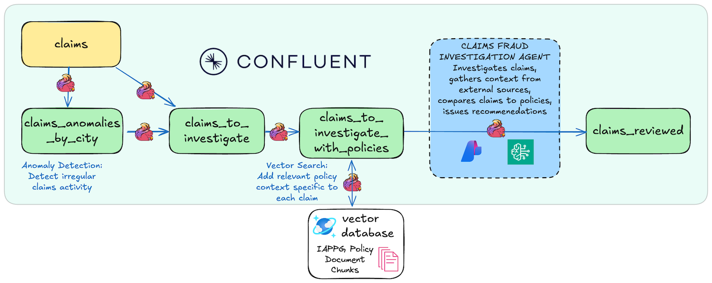

# Workshop - FEMA Insurance Claims Fraud Detection Using Confluent Intelligence



This demo showcases an intelligent, real-time fraud detection system that autonomously identifies suspicious claim patterns in FEMA disaster assistance applications. Built on [Confluent Intelligence](https://www.confluent.io/product/confluent-intelligence/), the system combines stream processing, anomaly detection, and AI-powered analysis to detect organized fraud rings and policy violations in real-time.

## Running this lab in GitHub Codespaces (optional but recommended for users with restricted access to their device)

You can run this lab in two ways:

- **Locally** on your own machine (original path), or
- **In GitHub Codespaces**, using only a web browser and a GitHub account.

When using GitHub Codespaces:

1. Login to your GitHub account (must **not** have Confluent organizational access).
2. Open this repository on GitHub.
3. Click **Code → Codespaces → Create codespace** on the branch you want to use (master).
4. Wait for the dev container to build and the Codespace to open in your browser.
5. Run all shell commands in this lab (for example `uv run deploy`) from the **Integrated Terminal** inside the Codespace.
6. Use your **local browser** (outside Codespaces) to access:
   - The [Flink UI](https://confluent.cloud/go/flink)
   - Other Confluent Cloud UI pages
   - AWS / Azure portals as needed for credentials

## Credentials for Workshop
- Github User Account (using GitHub Codespaces)
- Confluent Cloud User Account and Password
- AWS Bedrock API Key/Secret
- Zapier API Key/Secret

## Prerequisites - Run locally

**Local installation on macOS**

```bash
brew install uv git python && brew tap hashicorp/tap && brew install hashicorp/tap/terraform && brew install --cask confluent-cli

```

**Local installation on Windows**
```powershell
winget install astral-sh.uv Git.Git Hashicorp.Terraform ConfluentInc.Confluent-CLI Python.Python
```

Once software is installed (or your Codespace is ready), you'll need:

## Deploy the Demo using Codespace

Log in to Confluent Cloud
```bash
confluent login
```
Once you have your LLM API credentials ready, run the deployment script and choose **Lab4** when prompted:

```bash
uv run deploy
```

The deployment script will prompt you for your:
- Cloud provider (AWS/Azure) : Choose AWS
- LLM API keys (Bedrock keys or Azure OpenAI endpoint/key)

Select **"Lab 4: FEMA Fraud Detection"** from the menu.

---


